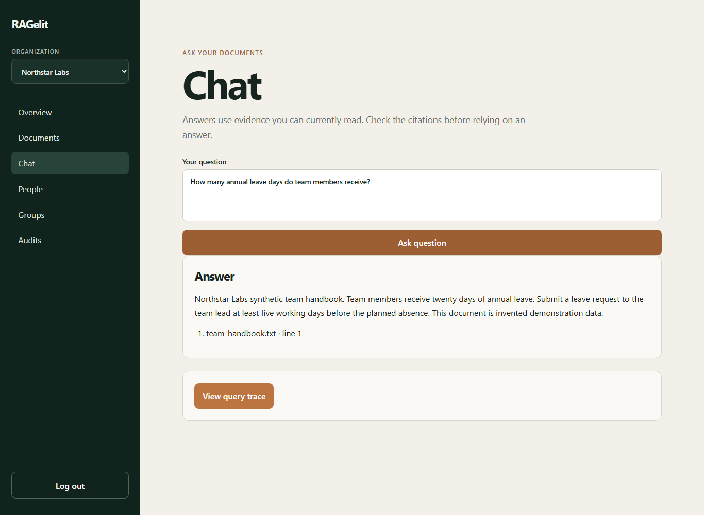
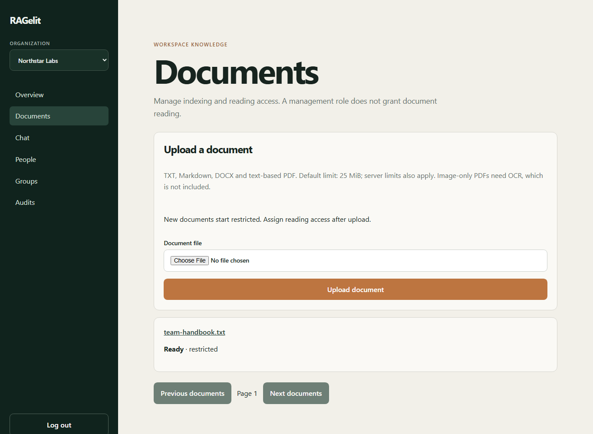
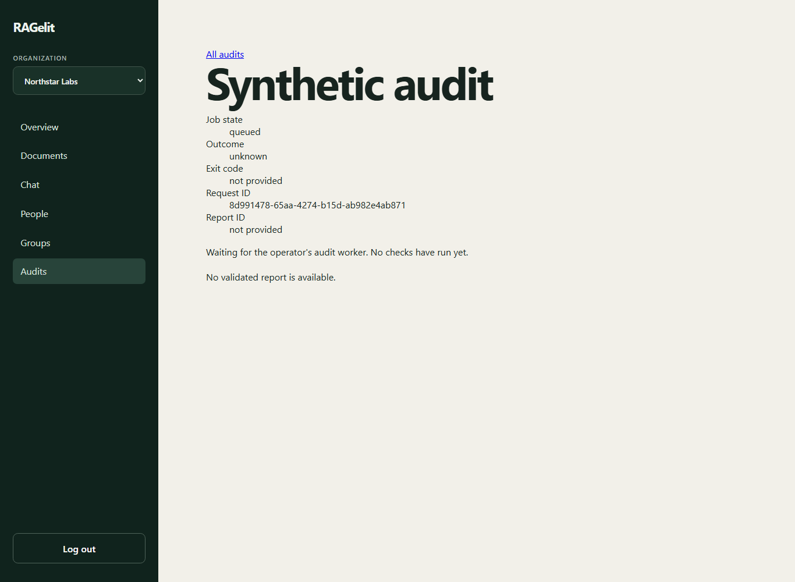
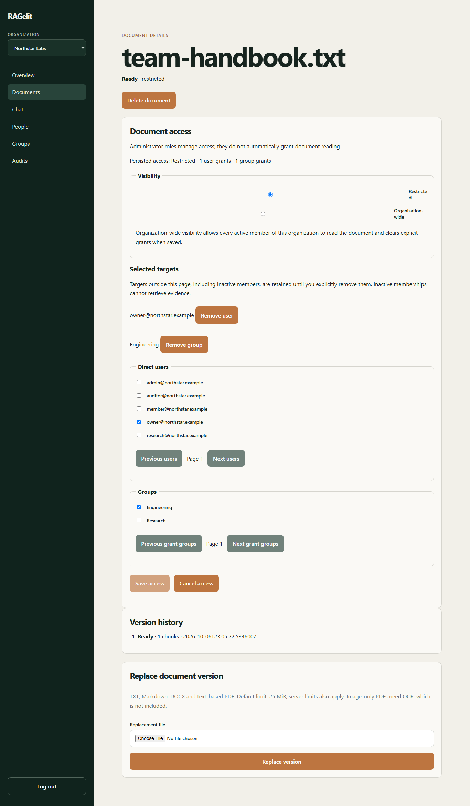
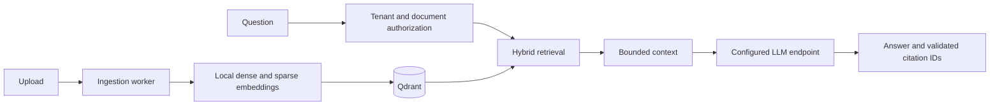

# RAGelit

A multi-tenant document assistant with permission-aware retrieval and automated
access-control auditing.

Upload documents, grant reading access, and ask questions with source citations
in one web portal. RAGelit also runs synthetic audits through the application
pipeline to show where unauthorized evidence appears or is blocked.

Status: working development build. Release verification and real-model quality
measurements are still incomplete; this is not a production security certification.

[Quick start](#quick-start) · [Operator reference](OPERATIONS.md) ·
[Security controls](docs/security/control-matrix.md) ·
[Verification checkpoint](docs/verification/2026-10-07-local-release-checkpoint.md)



Screenshots use invented Northstar Labs documents and accounts. The running
portal used the real API, PostgreSQL, Qdrant and ingestion worker with test-only
embeddings and an extractive answer provider. The answer above is a UI demo,
not a real-model quality result.

## What it does

- Separate organizations in one portal, with owner, admin, member and auditor roles.
- Ingest TXT, Markdown, DOCX and text-based PDF files, with versioning and retries.
- Keep new documents restricted; grant access to people, groups or an organization.
- Generate dense embeddings locally and combine vector search with BM25 retrieval.
- Return cited answers, abstain without supporting evidence, and expose scoped query traces.
- Run synthetic access-control audits and export redacted JSON or offline HTML evidence.
- Compare isolation strategies and replay utility, security and cost measurements from a CLI.

RBAC controls management actions. Document grants control reading. Being an
owner or uploading a document does not automatically make its contents readable.
Tenant and grant filters apply before dense and keyword search, followed by
application authorization checks. Audits distinguish retrieval, context and
candidate output from evidence actually delivered to a user.

## Portal

| Uploads and indexing | Synthetic audit queue |
|---|---|
|  |  |

The audit screenshot shows a queued job, not a passing result. An operator runs
the audit worker separately; pending jobs remain unknown until evidence is saved.

<details>
<summary>Document-level reading access</summary>



The policy shown has one persisted user grant and one group grant. Management
permissions and document reading access remain separate.

</details>

## How it works



PostgreSQL stores identities, document grants, versions, jobs and query traces,
with row-level security on tenant data. Workers handle ingestion and audits
outside the web process. The lab-only retrieve-then-filter baseline is guarded
from ordinary production configuration.

Backend: Python, FastAPI, SQLAlchemy, PostgreSQL, FastEmbed/ONNX and Qdrant.
Frontend: React, TypeScript, TanStack Query/Router and Vite. Dense retrieval uses
BGE-small-en-v1.5; sparse retrieval uses Qdrant BM25. Generation uses a configured
chat-completions-compatible server, not a provider login discovered automatically.

## Quick start

Requires Docker Desktop/Compose, Python 3.12 or 3.13, uv, and Node.js 22 with npm.
From the repository root on Windows:

```powershell
Copy-Item .env.example .env
docker compose up -d postgres qdrant
cd backend
uv sync --frozen
uv run --frozen alembic upgrade head
uv run --frozen python -m app.seed
uv run --frozen uvicorn app.main:create_app --factory --host 127.0.0.1 --port 8000
```

On Linux/macOS, replace `Copy-Item .env.example .env` with `cp .env.example .env`.
Save the demo passwords printed on the first seed; later seeds do not reset them.
In another terminal:

```console
cd frontend
npm ci
npm run dev
```

Open http://localhost:5173/login. Use `owner@northstar.example`, organization
`northstar-labs`, and its generated password. API docs are at
http://localhost:8000/docs.

To index uploads, run a worker from `backend` with the organization UUID returned
by `GET /api/v1/organizations` after login:

```console
uv run --frozen python -m app.workers.ingestion --organization-id <organization_uuid>
```

The first ingestion run downloads the public embedding models. Generation is
disabled by default. To answer questions with permitted evidence, configure
`RAGELIT_LLM_BASE_URL` and `RAGELIT_LLM_MODEL` for an already-running compatible
server, then restart the API. An external endpoint receives the question and
permitted context; choose it deliberately for private documents. See
[model setup, audit workers and recovery](OPERATIONS.md).

## Try the document workflow

1. Upload a supported document and wait for its state to become Ready.
2. Use Edit access to grant a person, group or the whole organization reading access.
3. Sign in as an authorized reader, ask a question in Chat, and inspect its citations.
4. Revoke access and ask a new question. Previous answers are not retroactively erased.

Audits use invented fixtures, not your uploaded company documents. Their positive
controls prevent a deny-all system from earning a pass. Exit codes are `0` for
pass, `1` for completed control failures and `2` for incomplete evidence or runtime
failure. Follow the [audit commands](OPERATIONS.md#synthetic-access-control-cli)
for the deliberately vulnerable lab and safe profiles.

## Verification and measured limits

Run `powershell -File scripts/verify.ps1` on Windows or `bash scripts/verify.sh`
on Linux/macOS. Use disposable local test services; the browser fixtures recreate
the dedicated `ragelit_e2e` database and collection. See the
[test setup](OPERATIONS.md#verify) before running either command.

The [latest checkpoint](docs/verification/2026-10-07-local-release-checkpoint.md)
records a clean Windows clone's complete 51-case safe audit, static checks,
frontend build and original report validation. The complete
[Linux CI run at f8e66bb](https://github.com/HuzaifaAbdulRehman/ragelit/actions/runs/37796567426)
also passed: 785 unit tests, 251 integration tests and 57 browser journeys,
plus static, build, secret and locked-dependency checks.

The same checkpoint records 57 passing Playwright journeys, a fresh three-profile
deterministic injection export, and a three-strategy deterministic isolation
export whose reports and receipts validate offline. These checks cover
application behavior and the audit harness. They do not establish real-model
answer quality or real-model injection resistance. It also records a fresh
safe/vulnerable/deny-all access-control demo with the expected 0/1/1 exits.

The full 87-query local baseline measured retrieval, but all generation requests
timed out at the unchanged deadline. Answer/citation quality and measured
revocation delay remain unknown. No real-model injection-resistance claim follows
from the deterministic audits. Docker Scout also found unresolved high/critical
findings in the pinned PostgreSQL and Qdrant images, so the project is not a
security-cleared v0.1 release. Logs and raw artifacts are retained locally;
remaining release checks are listed in the checkpoint.

No OCR, live token streaming, billing, invitations or retention purge is included.
Deletion stops retrieval but retains source files and inactive vectors. Citation
ID validation does not prove every generated claim is correct.

## Reference

- [Security control matrix](docs/security/control-matrix.md)
- [Metric definitions and artifact format](docs/evaluation/metric-definitions.md)
- [Pinned embedding assets](docs/evaluation/model-pins.md) and [local generation baseline](docs/evaluation/generation-pins.md)
- [OpenAPI contract](backend/openapi.json)
- [Third-party sources and notices](THIRD_PARTY_NOTICES.md)
- [Detailed local operations](OPERATIONS.md)
